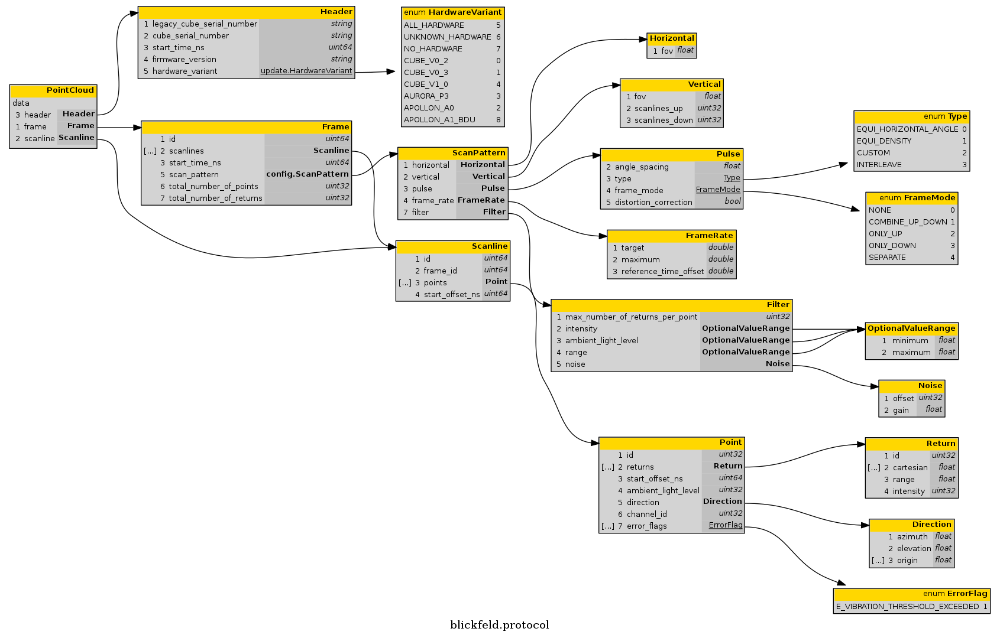

.. _BSL_Getting_started:

Getting started
===============

.. contents:: :local:
  :depth: 1

How to fetch Point Clouds
-------------------------

In this example the BSL will first be installed (compiled) and then a connection to a Blickfeld LiDAR device will be established and a pointcloud stream created.
Finally the Blickfeld Point Cloud Frames will be received.

Installing the BSL
~~~~~~~~~~~~~~~~~~

To install the BSL, either the Debian package or the PyPI package can be used.

.. tabs::

    .. code-tab:: c++

        sudo apt update
        sudo apt install -y wget libprotobuf-dev libprotobuf17
        wget https://github.com/Blickfeld/blickfeld-scanner-lib/releases/latest/download/blickfeld-scanner-lib-dev-Linux.deb
        sudo dpkg -i blickfeld-scanner-lib-dev-Linux.deb

    .. code-tab:: py

        pip install blickfeld_scanner

.. note:: For manual compilation instructions and further installation information refer to :ref:`BSL_Installation`.

Importing the library
~~~~~~~~~~~~~~~~~~~~~

To get a point cloud, the BSL has to be installed and the Blickfeld Scanner Library has to be imported.

.. tabs::

    .. code-tab:: c++

        #include <blickfeld/scanner.h>

    .. code-tab:: py

        >>> import blickfeld_scanner

Connecting
~~~~~~~~~~

A connection to the device has to be created.
In order to connect to a Blickfeld LiDAR device, a TCP connection must first be established.
We can use an IP address or a hostname, depending on the connection to the device (see :any:`../../network_configuration`).

.. tabs::

    .. code-tab:: c++

        std::string device_ip_or_hostname = "localhost";  // IP or hostname of the device
        std::shared_ptr<blickfeld::scanner> scanner = blickfeld::scanner::connect(device_ip_or_hostname);

    .. code-tab:: py

        >>> device_ip_or_hostname = "localhost"  # IP or hostname of the device
        >>> scanner = blickfeld_scanner.scanner(device_ip_or_hostname)
        >>> scanner
        <blickfeld_scanner.scanner.scanner object at 0x000002A611C1A710>

With this scanner object it is possible to perform different types of tasks, such as getting the status of a device (function :code:`get_status`) and
getting and setting the scan pattern (function :code:`get_scan_pattern` and :code:`set_scan_pattern`).

Streaming point clouds
~~~~~~~~~~~~~~~~~~~~~~

To receive a pointcloud, a stream object has to be generated. With this :code:`point_cloud_stream` object, point cloud frames can be received.

.. tabs::

    .. code-tab:: c++

        auto stream = scanner->get_point_cloud_stream();

    .. code-tab:: py

        >>> stream = scanner.get_point_cloud_stream()
        >>> stream
        <blickfeld_scanner.scanner.point_cloud_stream object at 0x000002A61289D1D0>

To receive a pointcloud frame, the :code:`recv_frame` function of the :code:`point_cloud_stream` object has to be called.
This can be done in a while loop.

.. tabs::

    .. code-tab:: c++

        while (true) {
            const blickfeld::protocol::data::Frame frame = stream->recv_frame();
            // TODO: Process received frame
        }

    .. code-tab:: py

        while True:
            frame = stream.recv_frame()
            # TODO: Process received frame

.. note::
    The device will drop frames if the client is unable to fetch the frames quickly enough.
    For this reason, the network connection and frame processing in the while loop need to be fast enough.
    To detect missing frames, the frame ID can be used. If the IDs are not consecutive, i.e., if IDs are missing, the receiving and processing pipeline will be too slow.

Format
~~~~~~

Each frame is a protobuf object that consists of several nested protobuf objects. The following figure provides an overview:

The following examples show how to get the values of protobuf fields. For further information on protobufs, see: `https://developers.google.com/protocol-buffers <https://developers.google.com/protocol-buffers>`_

.. tabs::

    .. code-tab:: c++

        frame.start_time_ns() / 1e9  // Get a field value
        frame.scan_pattern().frame_rate().maximum()  // Get a field in a nested protobuf object
        frame.scanlines_size()  // Get the size of a repeated protobuf field

    .. code-tab:: py

        >>> frame.start_time_ns / 1e9  # Get a field value
        1587462177.261129
        >>> frame.scan_pattern.frame_rate.maximum  # Get a field in a nested protobuf object
        1.2874246835708618
        >>> frame.scanlines[0].points[0]  # Get a value of a repeated nested field
        id: 0
        start_offset_ns: 0
        ambient_light_level: 5
        direction {
          azimuth: -0.005621920805424452
          elevation: -0.0010442694183439016
        }

To get values of the repeated nested protobuf objects, a loop can be used.
For example, to get values of the single returns it is necessary to loop through the scanlines, points and returns in a frame.

.. tabs::

    .. code-tab:: c++

        // Iterate through all the scanlines in a frame
        for (int s_ind = 0; s_ind < frame.scanlines_size(); s_ind++) {

            // Iterate through all the points in a scanline
            for (int p_ind = 0; p_ind < frame.scanlines(s_ind).points_size(); p_ind++) {
                auto& point = frame.scanlines(s_ind).points(p_ind);

                // Iterate through all the returns for each points
                for (int r_ind = 0; r_ind < point.returns_size(); r_ind++) {
                    auto& ret = point.returns(r_ind);
                    printf("coordinates: (%f, %f, %f)\n", ret.cartesian(0), ret.cartesian(1), ret.cartesian(2));

    .. code-tab:: py

        # Iterate through all the scanlines in a frame
        for s_ind in range(len(frame.scanlines)):

            # Iterate through all the points in a scanline
            for p_ind in range(len(frame.scanlines[s_ind].points)):
                point = frame.scanlines[s_ind].points[p_ind]

                # Iterate through all the returns for each points
                for r_ind in range(len(point.returns)):
                    ret = point.returns[r_ind]
                    print(f"coordinates: ({ret.cartesian[0]}, {ret.cartesian[1]}, {ret.cartesian[2]})")

For example, the x, y, and z coordinates are saved in "ret.cartesian(0)", which is equal to frame.scanlines(s_ind).points(p_ind).returns(r_ind).cartesian(0).

Closing a stream
~~~~~~~~~~~~~~~~

To close a stream, the :code:`point_cloud_stream` object must be deleted.

.. tabs::

    .. code-tab:: c++

        auto stream = scanner->get_point_cloud_stream();  // Create a stream
        ...  // Receive frames and do some fancy stuff
        delete stream;  // Close the stream

    .. code-tab:: py

        >>> stream = scanner.get_point_cloud_stream()  # Create a stream
        >>> stream
        <blickfeld_scanner.scanner.point_cloud_stream object at 0x000002A61289D1D0>
        >>> ...  # Receive frames and do some fancy stuff
        >>> del stream  # Close the stream
